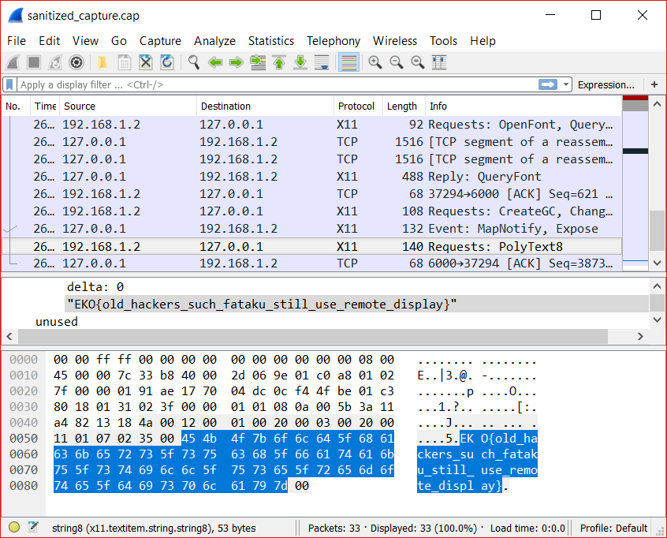

# X-Flag (misc, 150 points, solved by 54)

## Challenge

> Can you see the flag?
>
> http://f50bf71fa6dbc43f48fbb7e6ac749e4a7099b053.ctf.site:20000


## Solution

The linked website has an input labeled "Gimme a IP where I will send the flag".
Entering an IP we control and running tcpdump reveals the website is trying to connect on port 6000.
Furthermore, opening port 6000 with netcat and trying again reveals that the website is trying to make a connection using [X11](https://en.wikipedia.org/wiki/X_Window_System). 

Instead of installing the full X server software and remote accessing the display of our vps, we can simply fake it!
``` bash
# Install and run Xvfb ("Virtual Framebuffer 'fake' X server")
sudo apt-get install Xvfb
Xvfb :0 -screen - 1024x768x24 -ac &
# Listen for traffic
sudo tcpdump -vvvv host [website ip addr] -w capture.cap
```

After submitting our ip to the website again, our trace reveals the flag:



Flag: EKO{old_hackers_such_fataku_still_use_remote_display}
