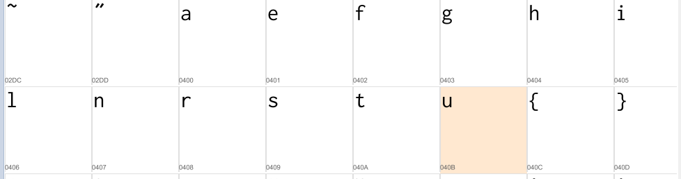
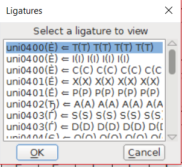

# Double Agent (for, 250 points, solved by 24)

## Challenge

> We have a man on the inside of Trump's campaign, but he's too afraid to leak secrets through normal communication methods.
> He swapped out the normal font on the campaign website for this one, and we suspect his data is inside.
> 
> [lexicographic.otf](./lexicographic.646ab52fa361f7d2b3649ccca31a26771ac7f30dad486e1880434210b9d83ae6.otf)
> 
> author's irc nick: Lense
> 
> EDIT: We provided the font. You do not need to go to any website to solve this.


## Solution

On initial inspection in a font viewer, there are some extra glyphs in the unicode section, but not in the right order.



Those glyphs are not likely to show up in everyday writings, perhaps there is another way for the font to make them show up in "normal" text?
Checking some things in font forge eventually reveals:



There are ligatures that point to those extra glyphs. It looks like there is one for every character. Let's try to translate a string using this ligature table and [translate.py](./translate.py).

``` bash
# Install libraries for fonts and xml
$ pip install fonttools untangle
# Export font to xml file
$ ttx lexicogprahic*.ttf
# Translate a string ("A".."Z") to new glyphs
$ ./translate.py
flag{itsallintheligatures}
```

Flag: flag{itsallintheligatures}
