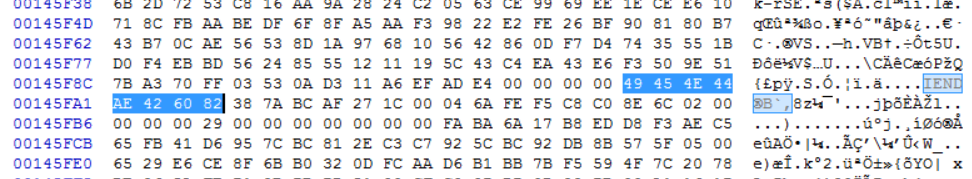
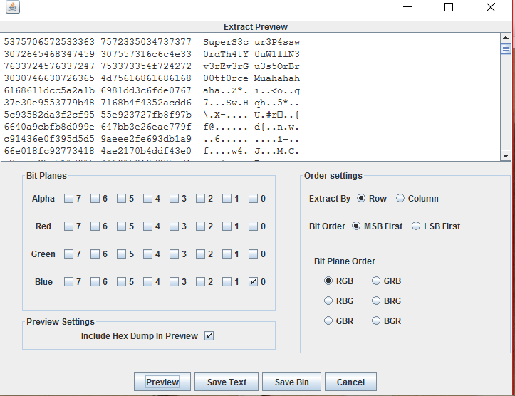

# Lockpicking (for, 350 points, solved by 4)

## Challenge

> You've been chosen to rig the ballots in favor of your candidate.
> You find the box, but it's locked with an indestructible padlock.
> Your only hope is to pick the lock!
> You'll need these tools to get the job done. Good luck ;)
>
> [lockpick](./lockpicking.ec95daebcc116c7f27e892d61a1333372e8903a039267e083a857a41deb37070.png)
>
> ```I found these keys, but they still don't open the padlock :( These lockpicks are starting to seem pretty insignificant```
> 
> author's irc nick: krx


## Solution

The png provided is very large, odds are it is holding some data!

``` bash
$ binwalk lockpicking*.png

DECIMAL         HEX             DESCRIPTION
-------------------------------------------------------------------------------------------------------
0               0x0             PNG image, 1692 x 672, 8-bit/color RGB, non-interlaced
42004142        0x280EEAE       PNG image, 970 x 450, 8-bit/color RGB, non-interlaced
```

There are two images, but it is very suspicious that the first one is around 40MB.
Let's try to find the end of the first png.



Right after the end of the PNG (`IEND\xAE\x42\x60\x82`), there seems to be a slighty incorrect 7z file header (`7z\xBC\xAF\x27\x1C`).
We can correct the header and extract all three files:
``` bash
# Check offsets in the file
$ binwalk lockpicking_fixed.png

DECIMAL         HEX             DESCRIPTION
-------------------------------------------------------------------------------------------------------
0               0x0             PNG image, 1692 x 672, 8-bit/color RGB, non-interlaced
1335205         0x145FA5        7-zip archive data, version 0.4
42004142        0x280EEAE       PNG image, 970 x 450, 8-bit/color RGB, non-interlaced
# Extract each file
$ dd if=./lockpicking_fixed.png of=./lockpicks.png bs=1 count=1335205
$ dd if=./lockpicking_fixed.png of=./archive.7z bs=1 skip=1335205 count=40668937
$ dd if=./lockpicking_fixed.png of=./keys.png bs=1 skip=42004142
```

It is not over yet, however.
The 7zip archive is password protected.
We can find the password in the blue LSB of lockpicks.png with stegsolve.



We extract the 7z file using the password from the first png, only to be confronted with another file, S3CR3T.
``` bash
$ file S3CR3T
S3CR3T: ISO Media, MPEG v4 system, version 1
```

It is a video, and watching it does not reveal a key.
But I have a [hunch](http://keyj.emphy.de/real-steganography-with-truecrypt/) something must be hidden in it.
We have yet to use the second png, an image of keys, so let's try something with that.
``` bash
$ mkdir secret_contents
$ sudo truecrypt -t -p "" -k keys.png --protect-hidden=no S3CR3T secret_contents
$ ls -al secret_contents/
drwx------ 4 vagrant vagrant 16384 Jan  1  1970 .
drwxrwxrwx 1 vagrant vagrant  4096 Nov  6 23:00 ..
-rwx------ 1 vagrant vagrant    42 Oct 23 05:32 flag.txt
drwx------ 2 vagrant vagrant  1024 Apr 19  2016 $RECYCLE.BIN
drwx------ 2 vagrant vagrant  1024 Apr 19  2016 System Volume Information
$ cat secret_contents/flag.txt
flag{p4dl0ck5_us3_A3S_n0w4d4ys_wh0_kn3w}
```

Flag: flag{p4dl0ck5_us3_A3S_n0w4d4ys_wh0_kn3w}
